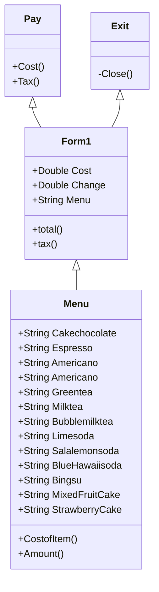

# Final-Project-Assignment
**ความเป็นมาของโปรแกรม**

``
เป็นโปรแกรมในการจัดการการขายPOS(Point of sale) การคิดบริการต่างๆ คิดคำนวณค่าภาษี(Tax)ในการบริการ รวมถึงเงินทอน ในการใช้บริการสินค้าโดยPos ที่นำมาวันนี้ใช้้เป็นการจัดการร้านคาเฟ่
``

**วัตถุประสงค์ของโปรแกรม**

``
1.เพื่อคำนวณสินค้าจำนวนมากๆในการใช้บริการต่อครั้ง
``

``
2.เพื่อไม่ให้เกิดการผิดดพลาดในการคำนวณ ยอดในการบริการแต่ละครั้ง
``

**Class Diagram**

**ผู้พัฒนาโปรแกรม**

``
นาย เทวารัณย์ ชัยกิจ รหัสนักศึกษา 643450324-6
``

   
      

      
